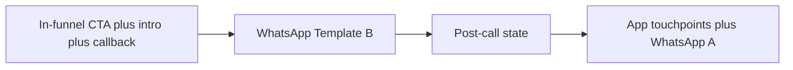

# Analysis: Shivi UX Layer Design Brief

**Source:** ACKO Drive — *Shivi UX Layer — Design Brief* (PDF).  
**Status:** Reference for design, product, and engineering alignment.

---

## Executive summary

The brief defines the **UX layer** for **Shivi**, ACKO Drive’s **voice-only AI agent**. Voice and routing already exist; this work covers **discovery, opt-in, callback scheduling, and post-call deal visibility**—not the in-call conversation UI. The strategic bet is **upstream discovery**: most ACKO car/bike policyholders do not know ACKO sells cars; Shivi is framed as an **assigned relationship manager** with **pricing authority** (ACKO Drive as seller), not an optional chatbot or third-party negotiator.

---

## Strategic problem and positioning

| Theme | Implication |
| ----- | ----------- |
| **Discovery over bottom-funnel conversion** | Surfaces must surface ACKO Drive to people not yet in-market or not aware of the product. |
| **Assign, don’t offer** | Copy and patterns should say Shivi is *assigned* (RM/concierge), not “try our AI.” |
| **Pricing authority** | Every touchpoint must communicate: **exclusive pricing only through Shivi**—not website, not call centre. Shivi *is* the deal-maker for ACKO Drive. |
| **Nurture first, call later** | WhatsApp introduces; outbound call is **fallback** after non-engagement, not the first move. |

**Copy pitfall (explicit in brief):** “Negotiate **with** Shivi” (she represents ACKO Drive)—not “Shivi negotiates **for** you” (implies a third party).

---

## Surfaces to design (six areas)

### 1. App touchpoints (multi-surface)

- **Where:** Homepage, car/bike **asset page**, service reminders, post-purchase, and other high-attention areas—**audit and recommend** top 2–3 placements (brief is intentionally open).
- **What:** Persistent, **non-intrusive** prompts; sample lines provided (exclusive price, compare options, negotiate).
- **Interaction:** Tap → **Shivi intro screen** (#4) → immediate or scheduled callback.
- **Audience:** **Targeted**—initially **5+ year old car owners**; design for **cohort expansion** without rebuild.
- **Design nuance:** Asset page = **“whisper, not banner”** (insurance context); homepage can be more direct.

### 2. In-funnel CTA (ACKO Drive web + app)

- **Where:** Lead/quote flows—**after** lead creation or quote, **not** first visit or browse-only.
- **What:** Three test variants (exclusive price / negotiate / callback convenience); must clarify **(a) AI** and **(b) real, exclusive deal**.
- **Interaction:** Tap → confirm/enter phone → callback within minutes.

### 3. WhatsApp (two templates)

- **Template A — Discovery (upstream):** Controlled experiment (~**5%** sample vs **95%** control); **cohort tracking** for measurement. Assigned-advisor framing, exclusive pricing, explicit negotiation-with-Shivi, CTA = deep link to intro or request callback.
- **Template B — In-funnel nurture:** Post-lead/browse; thanks + assigned RM; help + negotiate; CTA = talk now or schedule; **outbound call after X days** if no engagement.
- **Constraint:** Meta template rules—conversational, not promotional; avoid all-caps and exclamation marks.

### 4. Shivi intro screen (canonical landing)

Must communicate in order of emphasis:

1. **Who** — AI car advisor with pricing authority (not bot/FAQ-only).
2. **What they get** — Shivi-exclusive pricing (not on website or call centre).
3. **What happens next** — “Call me now” / “Schedule a call” → confirm phone (pre-filled from profile) → callback in minutes or at scheduled time.
4. **Trust signals** — e.g. users helped, average call duration (when data exists).

**Constraints:** Single focused screen—not a long landing page; **one clear action**; **returning users** → “Welcome back” not “Meet Shivi.”

### 5. Incentive presentation

- Every surface: **Shivi-exclusive** pricing authority, not generic “discount.”
- **Deal structure is a test variable** (price, %, bundles, warranty, insurance)—UI should flex without rebuild.
- **Pre-call:** no exact price; **post-call:** concrete deal visible and **attached** to profile/lead (e.g. card: amount, car, validity).

### 6. Post-call state

Replace generic “Meet Shivi” with:

- **Shivi deal** (exclusive price + validity window)
- **Summary** of discussion (car model, variant, price offered)
- **Talk to Shivi again**
- If human transfer during call: **human’s name and direct line**

Marked as **not strict v1** but **design now** to avoid retrofit.

---

## Explicit non-goals

- **No chatbot / text UI** — voice only for conversation.
- **Not** a full ACKO Drive redesign — **surgical** additions.
- **Not** final copy — directional only.

---

## Sequencing (priority if shipping incrementally)

1. **In-funnel CTA + intro + callback** — highest intent, best learning.
2. **WhatsApp Template B** — recapture users who leave without opting in.
3. **Post-call state** — completeness and persistence of the offer.
4. **App touchpoints + WhatsApp Template A** — upstream discovery; pilot lower urgency.

---

## Open questions (design-owned)

1. **Which app surfaces** and copy weight per intent.
2. **WhatsApp CTA mechanics:** deep link vs in-thread action / callback request.
3. **Callback timing copy** — specificity vs SLA risk (e.g. “2 minutes” vs “shortly” vs countdown).
4. **Pre-call pricing hint** (“up to ₹X”) vs opaque—tradeoff: opt-in vs anchoring.
5. **Shivi visual identity** — avatar, style, color; advisory and warm, not gimmicky.
6. **RM metaphor depth** — persistence, “My advisor,” memory expectations vs v1 capability.
7. **Negotiation framing** in all strings (with vs for).

---

## Cross-functional implications (brief → build)

| Function | Implications |
| -------- | ------------ |
| **Product / analytics** | Experiment design for Template A (5% / 95%), cohort IDs, funnel events from each entry point. |
| **Engineering** | Deep links to intro; profile phone pre-fill; lead/deal **attachment** model for post-call card; eligibility for **5+ year** cohort and future cohorts. |
| **Compliance** | WhatsApp/Meta templates; clarity that Shivi is **AI** where required for trust/regulatory posture. |
| **CRM / ops** | Callback SLA alignment with UX promises; human handoff data model if applicable. |

---

## Risks and dependencies

- **Overpromising** the “assigned RM” metaphor if product cannot support persistence or memory in v1.
- **SLA mismatch** if UI implies precise callback time without operational backing.
- **Trust:** Hiding AI or hiding exclusivity both harm conversion and trust; both must stay visible.

---

*This file implements the agreed analysis of the design brief; it is not a substitute for official ACKO product specs or legal/compliance sign-off.*
